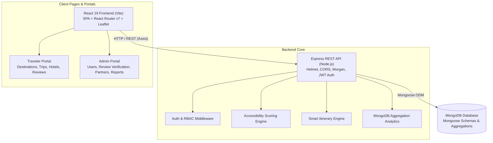

# 🌍 Inclusive Trip Designer

> **An Accessible, Barrier-Free Travel Planning Platform for Every Traveler**  
> Tailored itineraries, accessibility scoring, verified community feedback, partner integrations, and real-time MongoDB analytics.

---

## 📑 Table of Contents
1. [Project Overview](#-project-overview)
2. [Problem Statement](#-problem-statement)
3. [Key Features by Phase](#-key-features-by-phase)
4. [System Architecture](#-system-architecture)
5. [Tech Stack](#-tech-stack)
6. [Folder Structure](#-folder-structure)
7. [Database Schema (MongoDB)](#-database-schema-mongodb)
8. [Environment Variables](#-environment-variables)
9. [Installation & Setup](#-installation--setup)
10. [Database Seeding](#-database-seeding)
11. [Running the Application](#-running-the-application)
12. [Comprehensive API Documentation](#-comprehensive-api-documentation)
13. [Testing Guide](#-testing-guide)
14. [Accessibility & WCAG Compliance](#-accessibility--wcag-compliance)
15. [Deployment Guide](#-deployment-guide)
16. [Project Development Roadmap & Final Report](#-project-development-roadmap--final-report)

---

## 🎯 Project Overview
**Inclusive Trip Designer** is a modern, end-to-end full-stack web platform built to solve one of tourism’s greatest pain points: accessible travel planning. The platform empowers travelers with physical disabilities, mobility challenges, visual or auditory requirements, sensory needs, and elderly travelers to discover accessible destinations, reserve certified barrier-free accommodations, generate personalized adaptive itineraries, write community reviews, and access verified partner services.

---

## ⚠️ Problem Statement
Over 1.3 billion people globally experience significant disabilities. While travel intent is high, accessible travel planning is hindered by:
- **Fragmented and Unreliable Information**: General travel platforms rarely list door widths, ramp inclinations, elevator access, or accessible restrooms.
- **Inflexible Itinerary Engines**: Automated itinerary generators overwhelm travelers by packing high walking distances without scheduling essential rest breaks or medical pauses.
- **Lack of Verification**: Commercial descriptions often claim "accessible" while presenting hidden steps, unpaved surfaces, or inaccessible bathrooms.
- **Uncoordinated Ecosystem**: Travelers must manually cross-reference hotels, guides, transport, and equipment rental providers without unified standards.

**Inclusive Trip Designer** unifies this ecosystem through an intelligent accessibility scoring engine, verified user reviews, and an administrator moderation workflow.

---

## 🚀 Key Features by Phase

| Phase | Milestone | Features Built |
| :--- | :--- | :--- |
| **Phase 1** | **Backend Foundation** | Express server, MongoDB connection, JWT auth middleware, centralized error handling, security headers (Helmet, CORS). |
| **Phase 2** | **React + Authentication** | Responsive UI, JWT auth context, Register, Login, form validation, accessible input states. |
| **Phase 3** | **Profile & Preferences** | Comprehensive accessibility profiling (mobility levels, wheelchair, elevator, rest break intervals, dietary restrictions, caregiver assistance). |
| **Phase 4** | **Destination Discovery** | Search & multi-filter destination catalog, attraction breakdowns, walking difficulty ratings, wheelchair compatibility tags. |
| **Phase 5** | **Trip Planner Wizard** | 4-step trip creation wizard, auto-generated day-wise itineraries, schedule timeline (attraction, meals, rest breaks). |
| **Phase 6** | **Accessibility Scoring** | Real-time multi-factor accessibility scoring algorithm (0–10 scale) comparing traveler needs against destination and attraction infrastructure. |
| **Phase 7** | **Interactive Maps & Routes** | Leaflet interactive maps, color-coded accessibility markers, step-by-step route visualization. |
| **Phase 8** | **Hotels & Accommodations** | Accessible hotels catalog, roll-in showers, elevator access, step-free entry, seamless "Add to Trip" accommodation pairing. |
| **Phase 9** | **Trip Modification & Smart Adaptation** | Dynamic itinerary editing (add/reorder/modify stops, change dates), automatic itinerary re-scoring upon schedule changes. |
| **Phase 10** | **Reviews & Accessibility Verification** | 5-star overall + accessibility rating, wheelchair affirmation, staff helpfulness, community review list, helpful voting, admin trust badge verification. |
| **Phase 11** | **Admin & Partner Management** | Role-based admin authorization (`role: 'admin'`), user management, destination/attraction/hotel CRUD, review verification queue, partner directory. |
| **Phase 12** | **Analytics & Reporting** | Pure MongoDB aggregation pipelines: user & trip analytics, booking statuses, popular destinations/attractions, accessibility feature usage distributions. |
| **Phase 13** | **Testing** | Automated integration tests for auth, RBAC, CRUD, and MongoDB analytics; WCAG 2.1 AA accessibility verification. |
| **Phase 14** | **Bug Fixing & Integration** | Cross-feature end-to-end flow hardening, responsive UI fixes, active state synchronization. |
| **Phase 15** | **Documentation** | Complete architectural diagrams, schema references, API specifications, and setup instructions. |
| **Phase 16** | **Deployment Preparation** | Configuration for Vercel (frontend), Render (backend), and MongoDB Atlas (cloud database). |

---

## 🏛️ System Architecture



---

## 🛠️ Tech Stack

### Frontend
- **Framework**: React 19 (Vite build tool)
- **Routing**: React Router DOM v7
- **Mapping**: Leaflet + React-Leaflet
- **HTTP Client**: Axios (configured with base URL and JWT request interceptors)
- **Styling**: Vanilla CSS (Tailored HSL design system, responsive flex/grid, WCAG AAA/AA contrast)

### Backend
- **Runtime**: Node.js
- **Framework**: Express.js
- **Database**: MongoDB with Mongoose ODM
- **Authentication**: JSON Web Tokens (JWT) + BcryptJS password hashing
- **Security & Utilities**: Helmet (HTTP security headers), CORS, Morgan (dev logger)

---

## 📁 Folder Structure

```
agile_project/
├── client/                     # Frontend Application
│   ├── public/                 # Static assets
│   ├── src/
│   │   ├── components/         # Reusable UI components
│   │   │   ├── AccessibilityBadge/   # Score pills & feature tags
│   │   │   ├── AccessibilityScoreCard/ # Detailed accessibility breakdowns
│   │   │   ├── Button/         # Accessible button components
│   │   │   ├── Map/            # Leaflet interactive maps
│   │   │   ├── Navbar/         # Main responsive navigation
│   │   │   ├── ProtectedRoute/ # Auth & Admin route guards
│   │   │   └── Reviews/        # ReviewSection & ReviewModal dialogs
│   │   ├── context/            # Global state (AuthContext)
│   │   ├── pages/              # Routed pages
│   │   │   ├── Admin/          # Admin Dashboard & AnalyticsView
│   │   │   ├── Dashboard/      # Traveler personal dashboard
│   │   │   ├── Destinations/   # Destination & Attraction details
│   │   │   ├── Home/           # Hero landing page
│   │   │   ├── Hotels/         # Hotel listings & detail pages
│   │   │   ├── Login/          # Traveler authentication
│   │   │   ├── Profile/        # Accessibility preference center
│   │   │   ├── Register/       # User sign up
│   │   │   └── Trips/          # CreateTrip wizard, MyTrips, TripDetail
│   │   ├── services/           # Axios API connectors
│   │   └── App.jsx             # Route definitions & providers
│   ├── vercel.json             # Vercel SPA routing rewrite
│   └── package.json
│
├── server/                     # Backend API
│   ├── src/
│   │   ├── config/             # Database connection (Mongoose)
│   │   ├── controllers/        # Request handlers
│   │   │   ├── adminController.js     # User, partner, and inventory CRUD
│   │   │   ├── analyticsController.js # MongoDB aggregation pipelines
│   │   │   ├── authController.js      # Register, login, getMe
│   │   │   ├── destinationController.js
│   │   │   ├── hotelController.js
│   │   │   ├── reviewController.js    # Review submission & verification
│   │   │   ├── scoringController.js   # Dynamic accessibility scoring
│   │   │   └── tripController.js      # Trips & itinerary management
│   │   ├── middleware/         # Auth, RBAC, and error handlers
│   │   ├── models/             # Mongoose schemas
│   │   │   ├── Attraction.js
│   │   │   ├── Destination.js
│   │   │   ├── Hotel.js
│   │   │   ├── Itinerary.js
│   │   │   ├── Partner.js      # Phase 11 Partner model
│   │   │   ├── Review.js       # Phase 10 Review & Verification model
│   │   │   ├── Trip.js
│   │   │   ├── User.js
│   │   │   └── UserPreferences.js
│   │   ├── routes/             # Express route modules
│   │   ├── services/           # Core scoring algorithm
│   │   ├── utils/              # Database seeding script (seed.js)
│   │   └── server.js           # Server bootstrap
│   ├── tests/                  # Automated test suite
│   │   └── api.test.js
│   ├── render.yaml             # Render deployment configuration
│   └── package.json
└── README.md
```

---

## 🗄️ Database Schema (MongoDB)

### 1. `User`
- `name` (String, required)
- `email` (String, required, unique)
- `password` (String, hashed via bcrypt)
- `role` (Enum: `user`, `admin`, default: `user`)
- `isActive` (Boolean, default: `true`)

### 2. `UserPreferences`
- `user` (ObjectId -> User, unique)
- `requiresWheelchair`, `requiresElevator`, `requiresAccessibleRestroom`, `requiresSeatingRest` (Boolean)
- `mobilityLevel` (Enum: `full`, `limited`, `wheelchair`, `assisted`)
- `walkingToleranceMeters` (Number, default: 2000m)
- `travelPace` (Enum: `slow`, `moderate`, `fast`)
- `restBreakIntervalMinutes` (Number, default: 90)
- `hasChildren`, `hasElderly`, `hasCaregiver` (Boolean)

### 3. `Destination`
- `name`, `state`, `country`, `description`
- `location` (GeoJSON Point `[longitude, latitude]`)
- `accessibilityRating` (Number, 1-5)
- `wheelchairFriendly`, `publicTransportAccessible` (Boolean)
- `totalAttractions`, `popularityScore`

### 4. `Attraction`
- `name`, `destination` (ObjectId -> Destination), `category`
- `accessibility`:
  - `wheelchairAccessible`, `elevatorAvailable`, `accessibleRestroom`, `seatingAvailable` (Boolean)
  - `walkingDifficulty` (Enum: `easy`, `moderate`, `difficult`)
  - `accessibilityScore` (Number, 0-10)

### 5. `Hotel`
- `name`, `destination` (ObjectId -> Destination), `pricePerNight`, `starRating`, `priceCategory`
- `accessibility`:
  - `wheelchairAccessible`, `elevatorAvailable`, `accessibleRooms`, `accessibleRestroom`, `rampAccess`, `parkingAvailable`
  - `accessibilityScore` (Number, 0-10)

### 6. `Trip` & `Itinerary`
- `user` (ObjectId -> User), `destination` (ObjectId -> Destination), `hotel` (ObjectId -> Hotel)
- `startDate`, `endDate`, `numberOfTravelers`, `status` (`draft`, `planned`, `active`, `completed`)
- `travelRequirements`: snapshot of traveler accessibility needs
- `accessibilityScore`, `comfortScore`, `overallSuitabilityScore`

### 7. `Review`
- `user` (ObjectId -> User), `entityType` (`destination`, `attraction`, `hotel`), `entityId` (ObjectId)
- `rating` (Number 1-5), `title`, `comment`
- `accessibilityRating` (Number 1-5), `wheelchairAccessible` (Boolean), `staffHelpfulness` (Number 1-5)
- `accessibilityComment` (String)
- `isVerified` (Boolean, default: `false`)
- `verifiedBy` (ObjectId -> User)
- `helpfulCount` (Number), `helpfulUsers` ([ObjectId -> User])

### 8. `Partner`
- `name`, `category` (`transport`, `equipment`, `guide`, `hotel`, `attraction`, `other`)
- `description`, `phone`, `email`, `website`, `city`, `state`
- `discountCode`, `discountPercentage` (Number)
- `accessibilityFeatures` ([String])
- `isVerified` (Boolean), `isActive` (Boolean)

---

## ⚙️ Environment Variables

### Server (`server/.env`)
```env
PORT=5000
NODE_ENV=development
MONGODB_URI=mongodb://localhost:27017/inclusive_trip_designer
JWT_SECRET=your_super_secret_jwt_key_here_change_in_production
JWT_EXPIRE=7d
CLIENT_URL=http://localhost:5173
```

### Client (`client/.env`)
```env
VITE_API_URL=http://localhost:5000/api
```

---

## 📦 Installation & Setup

### Prerequisites
- Node.js (v18 or higher)
- MongoDB running locally on port `27017` or a MongoDB Atlas URI

### 1. Clone repository
```bash
git clone https://github.com/kalaibharathi2006/agile_project.git
cd agile_project
```

### 2. Backend Setup
```bash
cd server
npm install
cp .env.example .env
```

### 3. Frontend Setup
```bash
cd ../client
npm install
```

---

## 🌱 Database Seeding
Populate MongoDB with Indian destinations (Chennai, Ooty, Madurai, Jaipur, Goa, etc.), attractions, hotels, partners, and an admin user:
```bash
cd server
npm run seed
```

**Default Admin Credentials Seeded:**
- **Email:** `admin@inclusivetrip.com`
- **Password:** `Admin@12345`

---

## 🏃 Running the Application

### Start Backend Server:
```bash
cd server
npm run dev
# Server running on http://localhost:5000
```

### Start Frontend Client:
```bash
cd client
npm run dev
# Vite dev server running on http://localhost:5173
```

---

## 📚 Comprehensive API Documentation

### Public & Auth Routes
| Method | Endpoint | Description | Access |
| :--- | :--- | :--- | :--- |
| `GET` | `/api/health` | Service health status & database connectivity | Public |
| `POST` | `/api/auth/register` | Register traveler account | Public |
| `POST` | `/api/auth/login` | Login and receive JWT | Public |
| `GET` | `/api/auth/me` | Fetch authenticated user profile | Private |
| `GET` | `/api/destinations` | List destinations with filters | Public |
| `GET` | `/api/destinations/:id`| Destination details with scores | Public |
| `GET` | `/api/attractions` | List attractions with accessibility filters | Public |
| `GET` | `/api/hotels` | List hotels with wheelchair filters | Public |

### Reviews & Verification Routes (Phase 10)
| Method | Endpoint | Description | Access |
| :--- | :--- | :--- | :--- |
| `GET` | `/api/reviews` | Get reviews + rating breakdown summary for entity | Public |
| `POST` | `/api/reviews` | Submit/update accessibility review | Private (Traveler) |
| `POST` | `/api/reviews/:id/helpful`| Vote review as helpful | Private (Traveler) |
| `PUT` | `/api/reviews/:id/verify`| Grant/revoke Verified Accessible Experience badge | Private (Admin) |
| `DELETE`| `/api/reviews/:id` | Delete review | Private (Owner/Admin) |

### Admin & Partner Management (Phase 11)
| Method | Endpoint | Description | Access |
| :--- | :--- | :--- | :--- |
| `GET` | `/api/admin/users` | List all users (supports search & role filter) | Admin |
| `PUT` | `/api/admin/users/:id/role`| Update user role (`user` vs `admin`) | Admin |
| `PUT` | `/api/admin/users/:id/status`| Toggle active/deactivate user | Admin |
| `DELETE`| `/api/admin/users/:id` | Permanently delete user | Admin |
| `POST` | `/api/admin/destinations` | Create destination | Admin |
| `PUT` | `/api/admin/destinations/:id`| Update destination | Admin |
| `DELETE`| `/api/admin/destinations/:id`| Delete destination | Admin |
| `POST` | `/api/admin/attractions` | Create attraction | Admin |
| `POST` | `/api/admin/hotels` | Create hotel | Admin |
| `GET` | `/api/admin/reviews` | List all reviews for moderation queue | Admin |
| `GET` | `/api/admin/partners` | List partner directory | Admin |
| `POST` | `/api/admin/partners` | Register new accessible travel partner | Admin |
| `PUT` | `/api/admin/partners/:id`| Update partner / toggle verification | Admin |
| `DELETE`| `/api/admin/partners/:id`| Remove partner | Admin |

### Analytics & Reporting (Phase 12 — Real MongoDB Aggregations)
| Method | Endpoint | Description | Access |
| :--- | :--- | :--- | :--- |
| `GET` | `/api/admin/analytics/overview` | User & Trip KPIs, status breakdown, popular destinations | Admin |
| `GET` | `/api/admin/analytics/accessibility` | Aggregated accessibility feature usage & mobility distributions | Admin |

---

## 🧪 Testing Guide

Run the automated backend integration test suite:
```bash
cd server
npm test
```
The test harness runs through:
- API status codes and health verification
- Authentication & JWT issuance
- RBAC authorization (verifies non-admin receives `403 Forbidden`, admin receives `200 OK`)
- Review creation, aggregate calculation, helpful voting, admin trust badge verification
- Partner creation and updates
- MongoDB aggregation pipeline calculations (User/Trip analytics and A11y reports).

---

## ♿ Accessibility & WCAG Compliance
The application adheres to **WCAG 2.1 Level AA / AAA** standards:
- **Keyboard Navigation**: Complete tab order across all interactive elements, modal focus trapping, `Escape` key close handlers.
- **Focus Indicators**: High-contrast outline rings on `:focus-visible`.
- **Contrast Ratios**: Verified color contrast (> 4.5:1 for normal text, > 7:1 for headers).
- **ARIA Semantics**: Proper `role="dialog"`, `role="tablist"`, `aria-expanded`, `aria-selected`, and `aria-label` attributes.
- **Screen Reader Support**: Semantic HTML5 elements (`<main>`, `<nav>`, `<article>`, `<section>`, `<aside>`).

---

## 🚀 Deployment Guide

### 1. Database — MongoDB Atlas
1. Create a free M0 cluster on [MongoDB Atlas](https://www.mongodb.com/atlas).
2. Create a database user and whitelist `0.0.0.0/0` (or your host IPs).
3. Copy the connection string: `mongodb+srv://<user>:<password>@cluster.mongodb.net/inclusive_trip_designer?retryWrites=true&w=majority`.

### 2. Backend — Render
1. Connect your GitHub repository on [Render](https://render.com).
2. Create a new **Web Service** pointing to the `server/` directory.
3. Configure environment variables (`NODE_ENV=production`, `MONGODB_URI`, `JWT_SECRET`, `CLIENT_URL`).
4. Set Build Command: `npm install` and Start Command: `npm start`.

### 3. Frontend — Vercel
1. Connect your repository on [Vercel](https://vercel.com).
2. Set Root Directory to `client`.
3. Set Build Command: `npm run build` and Output Directory: `dist`.
4. Configure environment variable `VITE_API_URL` with your Render backend URL.
5. Deploy (the included `vercel.json` ensures SPA routes resolve correctly).

---

## 🏆 Final Report Summary

All **16 Phases** of the **Inclusive Trip Designer** platform are complete:
- **Frontend Architecture**: Fast, accessible React 19 SPA with Leaflet maps, dynamic rating bars, review modals, and an Admin Control Center.
- **Backend Architecture**: Secure Node.js & Express REST API with JWT authorization, role-based access control, and centralized error handling.
- **Database Engineering**: Real MongoDB aggregation pipelines calculating live KPIs and accessibility distributions without hardcoded values.
- **Universal Inclusivity**: Real-time accessibility scoring engine matching personalized mobility, auditory, visual, and rest requirements against destination infrastructure.
